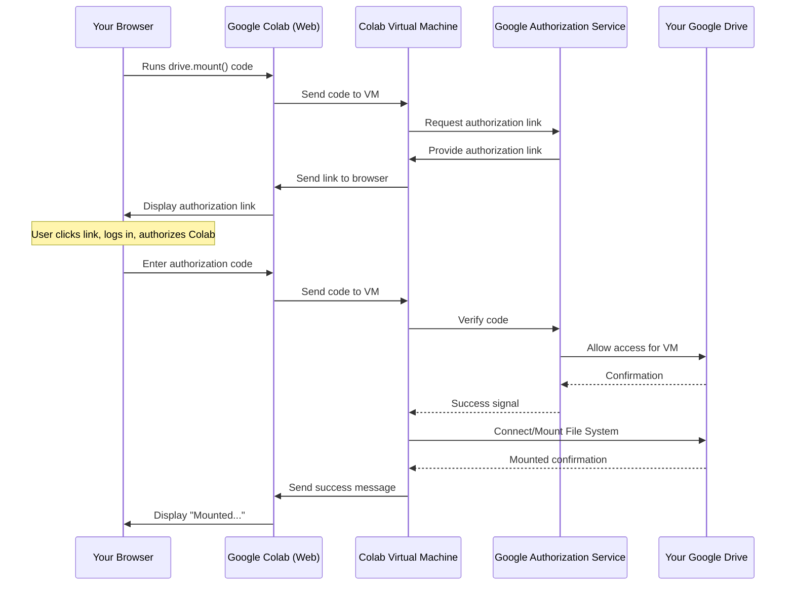

# Chapter 1: Google Colab Environment

Welcome to the first chapter of our YOLOv3 object detection tutorial! In this chapter, we'll get started with the platform where we'll be doing all our work: **Google Colab**. Think of it as your free workspace in the cloud, specially equipped for tasks like training powerful neural networks.

### What is Google Colab and Why Use It?

Training a complex neural network model like YOLOv3 requires a lot of computational power. Specifically, it benefits greatly from using a **Graphics Processing Unit (GPU)**. GPUs are like super-fast number crunchers that can handle the massive calculations needed for deep learning much faster than a standard computer's processor (CPU).

However, powerful GPUs can be expensive. This is where Google Colab comes in!

**Google Colab (or Colaboratory)** is a free, cloud-based service offered by Google that provides a ready-to-use environment for running Python code. The best part is that it offers **free access to GPUs**! This makes it an ideal platform for anyone wanting to learn and experiment with deep learning without investing in expensive hardware.

In short, we use Google Colab because:
1.  It's **free** to use.
2.  It provides access to **GPUs**, which are crucial for speeding up YOLOv3 training.
3.  It's a **notebook environment**, meaning you can mix code, explanations (like this tutorial!), and results in one place, making it easy to follow along step-by-step.

Our main goal in this chapter is to get our Colab environment ready for the project by ensuring we have a GPU and can save our work.

### Getting Started with Colab

To begin, you'll need a Google account.

1.  Go to the Google Colab website: [https://colab.research.google.com/](https://colab.research.google.com/)
2.  Create a new notebook (File > New notebook).
3.  **Crucially, enable the GPU runtime:** Go to the "Runtime" menu, select "Change runtime type", and under "Hardware accelerator", choose "GPU". Then click "Save". This connects your notebook to a virtual machine with a GPU.

Now you have a Colab notebook open and ready! The notebook consists of **code cells** (where you write and run code) and **text cells** (like this one, where you can add explanations).

### Verifying GPU Availability

Before we do anything else, let's check if our Colab notebook is indeed connected to a GPU. We can use a simple command-line tool called `nvidia-smi` (NVIDIA System Management Interface) for this.

In a code cell, type the following and press the "Run" button (the play icon) or `Shift + Enter`:

```bash
!nvidia-smi
```

The `!` at the beginning tells Colab to run this command as if you were typing it in a terminal, not as Python code. `nvidia-smi` is a command available in the Colab environment that shows information about the NVIDIA GPU attached.

**What to Expect:**

If a GPU is available and set up correctly, the output will look something like this (details may vary based on the exact GPU model provided by Colab):

```
+-----------------------------------------------------------------------------+
| NVIDIA-SMI 460.32.03    Driver Version: 460.32.03    CUDA Version: 11.2     |
|-------------------------------+----------------------+----------------------+
| GPU  Name        Persistence-M| Bus-Id        Disp.A | Volatile Uncorr. ECC |
| Fan  Temp  Perf  Pwr:Usage/Cap|         Memory usage | GPU-Util  Compute M. |
|                               |                      |               MIG M. |
|===============================+======================+======================|
|   0  Tesla T4            Off  | 00000000:00:04.0 Off |                    0 |
| N/A   39C    P8     9W / 70W |      0MiB / 15109MiB |      0%      Default |
|                               |                      |                  N/A |
+-------------------------------+----------------------+----------------------+
... (other process info)
```

The key information here is the **GPU Name** (e.g., `Tesla T4`) and the **Memory usage**. If you see a table like this, congratulations, your Colab environment has a GPU ready for action! If you see an error or information about CPU, double-check that you selected "GPU" in the runtime settings.

### Saving Your Work Permanently: Mounting Google Drive

Google Colab notebooks run on temporary virtual machines. This means that any files you download or create (like your dataset, model configuration, or trained weights) will be **deleted** when the session ends (after a period of inactivity or if you close the browser tab).

To avoid losing your progress and files, we need to connect your Colab environment to your Google Drive. This is called **mounting Google Drive**.

In a new code cell, run the following code:

```python
from google.colab import drive
drive.mount('/content/gdrive')
```

**What Happens When You Run This:**

1.  This code imports the necessary function (`drive`) from Colab's libraries.
2.  `drive.mount('/content/gdrive')` initiates the mounting process.
3.  Colab will provide a link asking you to authorize it to access your Google Drive.
4.  Click the link, select your Google account, and grant the permissions.
5.  Google will give you an authorization code. Copy this code.
6.  Go back to your Colab notebook and paste the code into the input box that appears below the code cell.
7.  Press Enter.

You should see a message like `Mounted at /content/gdrive`. This means your Google Drive is now accessible from within your Colab notebook at the path `/content/gdrive`.

You can navigate your Google Drive files within the Colab file explorer (the folder icon on the left sidebar) under the `/content/gdrive` directory. You can now save important files here, and they will persist even after your Colab session ends.

### How It Works: Behind the Scenes

When you run a code cell in Colab:

1.  Your web browser (running the Colab frontend) sends the code to Google's servers.
2.  Google allocates a **virtual machine (VM)** for your session (the Colab backend). This VM is like a temporary computer just for you. If you chose the GPU runtime, this VM has access to a GPU.
3.  The code is executed on this VM.
    *   Python code runs directly.
    *   Commands starting with `!` are run in the VM's shell (like a command prompt).
    *   The `drive.mount()` command uses special Colab-specific tools within the VM to establish a secure connection to your Google Drive account based on the authorization code you provide.
4.  The output (text, errors, etc.) is sent back to your browser and displayed in the output area of the code cell.

Here's a simplified diagram of the mounting process:



Now, your Colab VM can read and write files directly in your Google Drive folder `/content/gdrive`.

### Conclusion

In this chapter, we learned what Google Colab is and why it's essential for training YOLOv3 models (thanks to free GPU access!). We set up our environment by enabling the GPU runtime, verified it using `!nvidia-smi`, and connected our Google Drive using `drive.mount()` to ensure our data and results are saved.

With our powerful cloud environment ready, the next step is to understand the building blocks of our project's data.

Let's move on to [Chapter 2: Dataset Configuration (.data, .names, train.txt)](02_dataset_configuration___data___names__train_txt__.md).

---
