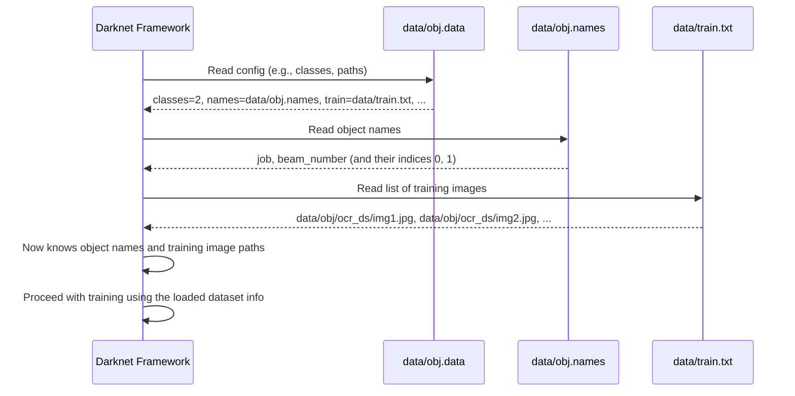

# Chapter 2: Dataset Configuration (.data, .names, train.txt)

Welcome back! In [Chapter 1: Google Colab Environment](01_google_colab_environment_.md), we got our powerful workspace set up in the cloud with GPU access and learned how to save our work using Google Drive. Now that we have our environment ready, it's time to tell the YOLOv3 system what we actually want it to find in images and where to find those images.

Think of this chapter as creating the "instruction manual" for our object detection project. Specifically, we need to configure three crucial files: `.data`, `.names`, and `train.txt`. These files tell the Darknet framework (the software that runs YOLOv3) everything it needs to know about the dataset we want to use for training.

### The Problem: Darknet Needs to Know Your Data

YOLOv3 is a general-purpose object detector, but to make it find *your* specific objects (like "job" and "beam_number" from our example), you need to provide it with examples (your dataset) and clearly define what those objects are. Darknet can't magically know that a certain bounding box in an image corresponds to a "job" unless you tell it.

So, how do we communicate our custom dataset details to Darknet?

This is where the `.data`, `.names`, and `train.txt` files come in. They act as the bridge between your prepared images and annotations and the Darknet training process.

Let's break down what each file does.

### 1. The `.names` File: Listing Your Object Names

The `.names` file is the simplest of the three. Its only job is to list the names of the objects (or classes) that you want YOLOv3 to detect, one name per line. The order matters! Darknet assigns an index (starting from 0) to each name based on its line number.

**Why is this needed?** When you train YOLOv3, it learns to recognize patterns associated with each object type. It needs to know the human-readable names for these types.

For our example, we are training the model to find two specific things: "job" and "beam_number".

Here's how we create the `data/obj.names` file with these names in our Colab environment (using the commands from the project's setup):

```bash
!echo -e 'job\nbeam_number' > data/obj.names
```

*   `!` at the start tells Colab to run this as a shell command.
*   `echo -e 'job\nbeam_number'` prints the text 'job', then a newline character (`\n`), then the text 'beam_number'.
*   `>` redirects this output into a file named `data/obj.names`. This file will be created inside the `darknet` directory we cloned in Chapter 1, specifically in the `data` subfolder.

After running this, if you were to look at the contents of `data/obj.names`, it would look like this:

```
job
beam_number
```

Now Darknet knows that index `0` corresponds to "job" and index `1` corresponds to "beam_number".

### 2. The `.data` File: The Main Configuration Hub

The `.data` file is like the central settings file for your dataset configuration. It tells Darknet key information, such as:

*   How many different types of objects are there?
*   Where is the list of training images?
*   Where is the list of validation (or testing) images? (Validation images are used to evaluate the model's performance during training, but aren't used for the training itself).
*   Where is the `.names` file we just created?
*   Where should the trained model files (weights) be saved?

**Why is this needed?** Darknet needs a single place to look up all the essential paths and parameters related to your specific dataset.

Here's the command to create our `data/obj.data` file based on the project's setup:

```bash
!echo -e 'classes= 2\ntrain  = data/train.txt\nvalid  = data/test.txt\nnames = data/obj.names\nbackup = /content/weight' > data/obj.data
```

Let's break down the lines in this file:

*   `classes = 2`: This tells Darknet there are 2 different object classes it needs to detect (`job` and `beam_number`). This number *must* match the number of lines in your `.names` file.
*   `train = data/train.txt`: This specifies the path to the file that lists all your training images. We'll create this file next. The path `data/train.txt` is relative to the `darknet` directory.
*   `valid = data/test.txt`: This specifies the path to the file that lists your validation images. The project snippet uses `data/test.txt`. For this basic tutorial, we might not use a separate validation set, or the `test.txt` file might be empty or list just a few images for quick checks. For larger, real-world projects, you would split your dataset into training and validation sets and list the validation image paths here.
*   `names = data/obj.names`: This provides the path to the `.names` file we just created.
*   `backup = /content/weight`: This tells Darknet where to save the model's weights files periodically during training. If you want to save your trained model files persistently (so they don't disappear when your Colab session ends), you should change this path to point to a folder in your Google Drive, for example, `/content/gdrive/MyDrive/Yolo_v3/backup_weights`. *Note: The project's snippet saves configuration files to Google Drive later, but the `.data` file itself specifies a temporary Colab path for weights. For persistence, you'd typically modify this line.*

After running this command, the contents of `data/obj.data` will look like this:

```
classes= 2
train  = data/train.txt
valid  = data/test.txt
names = data/obj.names
backup = /content/weight
```

### 3. The `train.txt` File: Listing Your Training Images

The `train.txt` file is simply a text file where each line is the full path to one of your training images.

**Why is this needed?** Darknet doesn't automatically scan folders for images. It needs an explicit list of *which* images to use for training. This file provides that list.

Creating this file involves listing all your training images and writing their paths into `data/train.txt`. Our project snippet assumes your images are unzipped into the `data/obj/ocr_ds/` directory within the `darknet` folder. It uses a Python script to find all `.jpg` files in that location and write their paths to `train.txt`.

Here's the Python code used (which is run in a Colab code cell):

```python
import glob

# Find all .jpg files in the specified directory
images_list = glob.glob("data/obj/ocr_ds/*.jpg")

# Open data/train.txt in write mode
with open("data/train.txt", "w") as f:
    # Join all image paths with a newline character in between
    f.write("\n".join(images_list))
```

*   `import glob`: This imports a Python module that helps find files based on patterns (like `*.jpg`).
*   `glob.glob("data/obj/ocr_ds/*.jpg")`: This finds all files ending with `.jpg` inside the `data/obj/ocr_ds/` directory and returns a list of their paths.
*   `with open("data/train.txt", "w") as f:`: This opens the file `data/train.txt` for writing (`"w"`). The `with` statement ensures the file is automatically closed afterward. The opened file is referred to by the variable `f`.
*   `f.write("\n".join(images_list))`: This takes the `images_list` (which is a Python list of file paths) and joins them together into a single string. It puts a newline character (`\n`) between each path. This string is then written to the `data/train.txt` file.

After running this code, `data/train.txt` will contain a list of image paths, looking something like this (with your actual image paths):

```
data/obj/ocr_ds/image_001.jpg
data/obj/ocr_ds/image_002.jpg
data/obj/ocr_ds/another_image.jpg
...
```

Now Darknet has the complete list of images to train on.

### How It All Fits Together: Darknet Reads the Instructions

When you start the Darknet training command later ([Chapter 5: Training Process](05_training_process_.md)), Darknet needs to load your dataset information. Here's the simplified flow of how it uses these three files:



This sequence shows how the `.data` file serves as the entry point, guiding Darknet to the other necessary files (`.names` and `train.txt`) to fully understand your custom dataset.

### Analogy

Imagine you're preparing to teach someone to identify specific types of fruits in pictures.

*   The `.names` file is like giving them a list of the names of the fruits they need to learn: "Apple", "Banana", "Orange".
*   The `train.txt` file is like giving them a physical pile of pictures, where each picture shows one or more of these fruits.
*   The `.data` file is like a note that says: "Okay, here's the list of fruit names (pointing to the names list). Here's the pile of pictures to study (pointing to the pile). There are 3 kinds of fruits to learn. When you're ready, save your study notes here (pointing to a backup folder)."

Without all three pieces of information linked correctly, the teaching (training) process can't begin!

### Conclusion

In this chapter, we configured the essential files that tell the Darknet framework about our custom dataset. We created:

*   `data/obj.names`: Listing the names of the objects we want to detect (`job`, `beam_number`).
*   `data/obj.data`: The main configuration file pointing to the number of classes, the names file, the list of training images, and where to save weights.
*   `data/train.txt`: A list of all the image files that Darknet should use for training.

These files provide Darknet with the fundamental information about *what* to detect and *where* the training examples are located. With the dataset defined, the next crucial step is to configure the YOLOv3 model itself for our specific task.

Let's move on to [Chapter 3: YOLOv3 Model Configuration (.cfg)](03_yolov3_model_configuration___cfg__.md).

---
