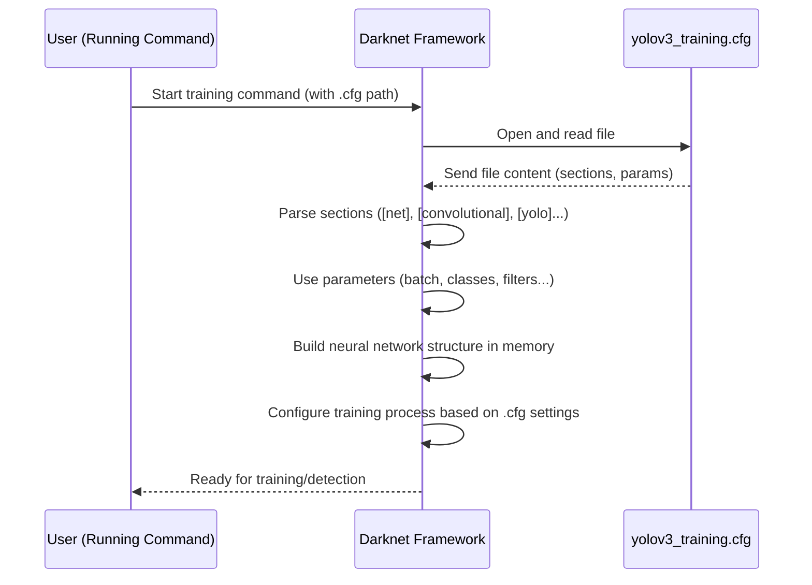

# Chapter 3: YOLOv3 Model Configuration (.cfg)

Welcome back! In [Chapter 1: Google Colab Environment](01_google_colab_environment_.md), we set up our free cloud workspace. In [Chapter 2: Dataset Configuration (.data, .names, train.txt)](02_dataset_configuration___data___names__train_txt__.md), we told the Darknet framework *what* objects to look for and *where* to find the training images.

Now that Darknet knows about our data, it needs the instructions on how to build the actual neural network model that will learn to find those objects. This is where the **YOLOv3 model configuration file**, typically ending with `.cfg`, comes in.

### The Problem: The Default Model Isn't Built for Your Objects

The standard YOLOv3 model (often configured in a file called `yolov3.cfg`) is pre-configured to detect objects from a huge dataset called COCO, which has 80 different object classes (like person, car, dog, etc.).

However, our project focuses on detecting just two specific objects: "job" and "beam_number". We don't need a model configured for 80 classes; we need one specifically tailored for our 2 classes. We also might want to tweak some training settings like how many images the model processes at once.

The `.cfg` file is the blueprint that defines the entire structure of the YOLOv3 network – what types of layers it has (like convolutional layers that process images), how many of them, how they connect, and also contains crucial training parameters. We need to modify this blueprint to match our custom task.

### What is a `.cfg` File? The Model's Blueprint

Imagine you're building a complex machine. You'd need a detailed blueprint showing every part, how it's connected, and operational settings. The `.cfg` file is exactly that for the YOLOv3 neural network.

It's a plain text file containing different sections, where each section defines either a layer in the network or global configuration settings for training.

Here's a simplified look at what you might see inside (the actual file is much longer and more complex):

```
[net]       # Global network settings
batch=1     # Number of images per training batch
subdivisions=1 # Further split batches
width=416   # Input image width
height=416  # Input image height
channels=3  # Input image channels (RGB)
...
learning_rate=0.001
max_batches=500200 # How many training steps

[convolutional] # Example of a layer definition
filters=32
size=3
stride=1
pad=1
activation=leaky
...

[yolo] # The final prediction layer (there are multiple)
mask = 6,7,8
anchors = 10,13,  16,30,  33,23,  30,61,  62,45,  59,119,  116,90,  156,198,  373,326
classes=80 # << This needs changing for us!
...
```

Each `[section_name]` defines a block, and the lines below it set parameters for that block.

### Why We Modify the `.cfg` for Custom Training

We need to make specific changes to the default `yolov3.cfg` to adapt it for our 2-class dataset:

1.  **Number of Classes:** The most important change is telling the network how many objects it should try to detect. The default is 80 (for COCO); we need to change this to 2.
2.  **Number of Filters in Prediction Layers:** The final layers of the network that actually output the detection boxes and class probabilities (`[yolo]` layers) have a specific number of output "filters". This number is directly related to the number of classes. The formula used in Darknet for YOLOv3 is:
    `filters = (classes + 5) * 3`
    *   `classes`: The number of object classes you have.
    *   `5`: Represents the 4 bounding box coordinates (x, y, width, height) and 1 objectness score (confidence that an object is present).
    *   `3`: Represents the 3 anchor boxes used by each detection layer at each grid cell location.
    For 80 classes: `filters = (80 + 5) * 3 = 85 * 3 = 255`. This is why you see `filters=255` in the default config.
    For our 2 classes: `filters = (2 + 5) * 3 = 7 * 3 = 21`. We need to change `filters` to 21 in the relevant layers.
3.  **Training Parameters:** We might also want to adjust how the training runs, such as `batch` size, `subdivisions`, and `max_batches`.
    *   `batch`: Number of images processed in one go. Larger batches can sometimes lead to more stable training but require more GPU memory.
    *   `subdivisions`: Darknet splits the `batch` into smaller `subdivisions` that fit into GPU memory. The effective batch size is `batch / subdivisions`. We need to increase `batch` for better training and `subdivisions` to fit it into Colab's GPU memory.
    *   `max_batches`: The total number of training iterations (steps) the model will perform. The default is very high (500200) for the massive COCO dataset. For a smaller custom dataset, a lower number like 4000 or 6000 is often sufficient. A common rule of thumb is `max_batches = num_classes * 2000`, but this can vary. For our 2 classes, 4000 is a reasonable starting point.

### How to Modify the `.cfg` File

The project snippet uses command-line tools within Colab to modify a copy of the default `yolov3.cfg` file.

First, it makes a copy of the original file:

```bash
!cp cfg/yolov3.cfg cfg/yolov3_training.cfg
```

*   `!`: Run as a shell command.
*   `cp`: Copy command.
*   `cfg/yolov3.cfg`: Source file (the original default config).
*   `cfg/yolov3_training.cfg`: Destination file (our new config specifically for training). This keeps the original `yolov3.cfg` untouched.

Next, it uses the `sed` command to find and replace specific lines in the new `yolov3_training.cfg` file. `sed` is a powerful text manipulation tool. The `s/old_text/new_text/` part tells `sed` to substitute `old_text` with `new_text`.

Let's look at the `sed` commands used in the project:

```bash
# Change batch and subdivisions
!sed -i 's/batch=1/batch=64/' cfg/yolov3_training.cfg
!sed -i 's/subdivisions=1/subdivisions=16/' cfg/yolov3_training.cfg
```

*   `!sed -i`: Run `sed` with the `-i` option, which means edit the file in place.
*   `'s/batch=1/batch=64/'`: Finds the line `batch=1` and changes it to `batch=64`.
*   `'s/subdivisions=1/subdivisions=16/'`: Finds the line `subdivisions=1` and changes it to `subdivisions=16`.
    *   This sets the effective batch size to `64 / 16 = 4` images per GPU processing step.

```bash
# Change max_batches
!sed -i 's/max_batches = 500200/max_batches = 4000/' cfg/yolov3_training.cfg
```

*   `'s/max_batches = 500200/max_batches = 4000/'`: Changes the total number of training steps from the default 500200 to 4000.

```bash
# Change classes in the three [yolo] layers
!sed -i '610 s@classes=80@classes=2@' cfg/yolov3_training.cfg
!sed -i '696 s@classes=80@classes=2@' cfg/yolov3_training.cfg
!sed -i '783 s@classes=80@classes=2@' cfg/yolov3_training.cfg
```

*   `'610 s@classes=80@classes=2@'`: This is slightly different. `610` means apply this substitution only on line number 610. `s@classes=80@classes=2@` finds `classes=80` and replaces it with `classes=2`. We use `@` instead of `/` as the delimiter because the search pattern doesn't contain `@`.
*   YOLOv3 has three detection scales, each ending with a `[yolo]` layer. These `sed` commands target the `classes` parameter in each of these three `[yolo]` layers (which happen to be around lines 610, 696, and 783 in the standard `yolov3.cfg`).

```bash
# Change filters in the convolutional layer BEFORE each [yolo] layer
!sed -i '603 s@filters=255@filters=21@' cfg/yolov3_training.cfg
!sed -i '689 s@filters=255@filters=21@' cfg/yolov3_training.cfg
!sed -i '776 s@filters=255@filters=21@' cfg/yolov3_training.cfg
```

*   Similar to changing `classes`, these commands target the `filters` parameter in the `[convolutional]` layer that comes *just before* each of the three `[yolo]` layers (around lines 603, 689, and 776).
*   As calculated before, `(2 classes + 5) * 3 anchors = 21 filters`.

After running these commands, the `cfg/yolov3_training.cfg` file will be updated with the settings suitable for training on our 2-class dataset.

### Summarizing the Key Changes

Here's a summary of the important parameters changed for our 2-class custom training:

| Parameter     | Original Value (for COCO 80 classes) | New Value (for our 2 classes) | Why?                                                |
| :------------ | :----------------------------------- | :---------------------------- | :-------------------------------------------------- |
| `batch`       | 1                                    | 64                            | Increased for better training, effective batch 4.   |
| `subdivisions`| 1                                    | 16                            | To fit the larger batch into Colab GPU memory.      |
| `max_batches` | 500200                               | 4000                          | Sufficient iterations for a smaller custom dataset. |
| `classes`     | 80                                   | 2                             | To detect only our specific objects.                |
| `filters`     | 255                                  | 21                            | Output size must match `(classes + 5) * 3`.         |

### How Darknet Uses the `.cfg` File (Under the Hood)

When you start training or detection using Darknet, it first reads the specified `.cfg` file.

1.  **File Parsing:** Darknet opens the `.cfg` file and reads it line by line.
2.  **Layer Definition:** When it encounters a line like `[convolutional]` or `[yolo]`, it understands that a new network layer or block is being defined. It then reads the parameters below that section (`filters`, `size`, `classes`, etc.).
3.  **Network Construction:** Based on these definitions, Darknet dynamically builds the neural network model in memory. It allocates space for the weights (the numbers the network will learn) according to the `filters` and other size parameters specified.
4.  **Parameter Loading:** Global parameters like `batch`, `max_batches`, `learning_rate` are read and stored for use during the training loop.
5.  **Training/Inference Setup:** With the network structure built and parameters loaded, Darknet is ready to start either the training process (using the dataset info from the `.data` file and images from `train.txt`) or perform detection on a new image.

Here's a simple sequence:



This blueprint step is crucial because it tells Darknet the exact architecture and settings it needs to use to train your object detection model for *your specific task* with the correct number of classes and optimized training flow.

### Analogy

If the `.data`, `.names`, and `train.txt` files are like telling someone *what* fruits to identify and *where* to find the pictures, the `.cfg` file is like giving them the specific "visual guide" (the neural network structure) they should use, detailing how many layers of visual analysis to perform, how many different fruit types to prepare for, and how long they should study (max\_batches).

### Conclusion

In this chapter, we learned that the `.cfg` file is the detailed blueprint for the YOLOv3 neural network model. We understood why the default configuration needs modification for a custom dataset and saw how to change key parameters like `classes`, `filters`, `batch`, `subdivisions`, and `max_batches` using command-line tools.

With the dataset information configured in [Chapter 2](02_dataset_configuration___data___names__train_txt__.md) and the model structure defined in this chapter, we now have the two main configuration pieces ready. The next step is to understand the software that brings it all together – the Darknet framework itself.

Let's move on to [Chapter 4: Darknet Framework](04_darknet_framework_.md).

---
