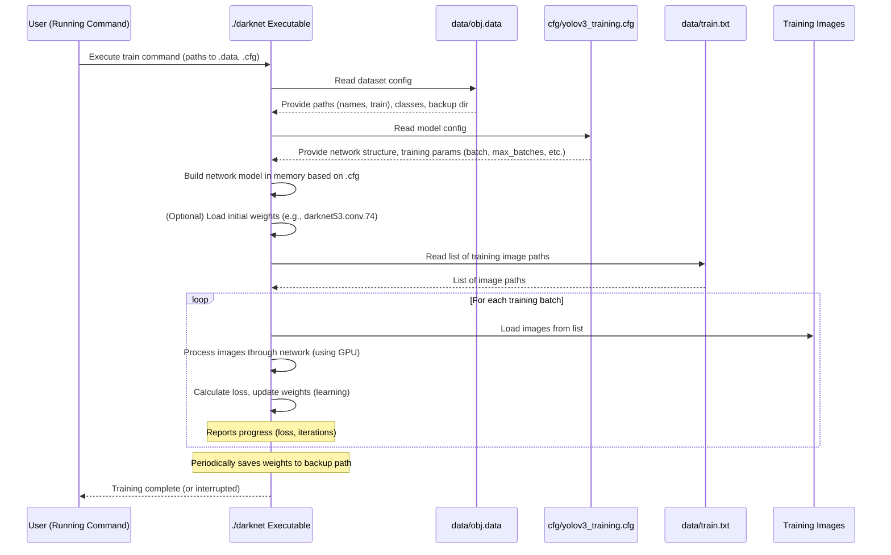

# Chapter 4: Darknet Framework

Welcome back! So far in our journey, we've set up our powerful cloud workspace in [Chapter 1: Google Colab Environment](01_google_colab_environment_.md), defined *what* objects we want to detect and *where* to find the training data in [Chapter 2: Dataset Configuration (.data, .names, train.txt)](02_dataset_configuration___data___names__train_txt__.md), and configured the *blueprint* for our YOLOv3 model itself in [Chapter 3: YOLOv3 Model Configuration (.cfg)](03_yolov3_model_configuration___cfg__.md).

But who actually *does* the heavy lifting? Who reads these configuration files, processes the images, builds the neural network according to the blueprint, and performs the complex calculations required for training and detection?

This is the job of the **Darknet Framework**.

### What is Darknet? The Engine of YOLOv3

Think of Darknet as the specialized software application or engine that powers YOLO. It's a command-line framework, primarily written in the C programming language (known for its speed and efficiency), specifically designed to build, train, and run neural networks, especially YOLO.

If our `.cfg` file is the blueprint of the building (the network) and our `.data` file and images are the materials, then **Darknet is the construction team with all their specialized tools and machinery**. You give Darknet the blueprint and the materials, and it constructs the building and gets it ready for use (training/detection).

It doesn't have a fancy graphical interface; you interact with it by typing commands into a terminal or, in our case, using the `!` prefix in Colab code cells to run shell commands.

### Why Use Darknet for YOLOv3?

YOLO was originally developed and released alongside the Darknet framework by the same creators (Joseph Redmon and Ali Farhadi). Darknet was built from the ground up with YOLO in mind, making it highly optimized for this specific architecture. While YOLO can now be used with other frameworks like TensorFlow or PyTorch, using Darknet is often considered the native and highly efficient way, especially for certain versions like YOLOv3. Its C implementation allows it to work very closely with the GPU for maximum speed.

### How We Interact with Darknet in Colab

In Google Colab, we don't run Darknet by clicking icons. We use shell commands, just like you would in a Linux terminal. The `!` or `%cd` commands in Colab allow us to execute these commands directly on the virtual machine.

Our Colab notebook essentially guides Darknet through a series of steps:

1.  **Get the Darknet software:** Download the Darknet source code.
2.  **Configure Darknet:** Tell Darknet how to prepare itself for our Colab environment (especially to use the GPU).
3.  **Build Darknet:** Compile the source code into an executable program.
4.  **Run Darknet:** Execute the program with specific commands to perform tasks like training or detection, pointing it to the configuration and data files we prepared.

Let's look at the Colab code snippets that demonstrate these interactions, linking them back to the actions we saw in the project notebook.

### 1. Getting Darknet: Cloning the Repository

The first interaction is getting the Darknet code itself. We use `git clone` to download it from its source on GitHub.

```bash
# Clone the Darknet repository
!git clone https://github.com/AlexeyAB/darknet
```

*   `!`: Run this as a shell command.
*   `git clone`: Standard command to download a Git repository.
*   `https://github.com/AlexeyAB/darknet`: The web address where the Darknet code is stored.

After running this, a folder named `darknet` appears in our Colab file system, containing all the Darknet source code files.

Then, we change our current directory to this new `darknet` folder so subsequent commands run from inside it:

```bash
# Change into the darknet directory
%cd darknet
```

*   `%cd`: A special Colab command (also works in IPython/Jupyter) to change the current working directory. This is equivalent to the shell command `cd`.
*   `darknet`: The name of the folder we just cloned.

### 2. Configuring Darknet: Modifying the Makefile

Darknet needs to be compiled (built) into a program that can run on our specific system. The `Makefile` contains instructions for this build process. We need to edit this file to enable GPU support, CUDA Deep Neural Network library (CUDNN) support (which speeds up training on GPUs), and OpenCV support (for image loading/saving).

We use the `sed` command to make these changes directly in the `Makefile`.

```bash
# Enable OpenCV, GPU, and CUDNN in the Makefile
!sed -i 's/OPENCV=0/OPENCV=1/' Makefile
!sed -i 's/GPU=0/GPU=1/' Makefile
!sed -i 's/CUDNN=0/CUDNN=1/' Makefile
```

*   `!`: Run as shell command.
*   `sed -i`: Use `sed` to edit the file in place (`-i`).
*   `'s/OPENCV=0/OPENCV=1/' Makefile`: Find the line `OPENCV=0` and replace it with `OPENCV=1` in the file `Makefile`. Similar changes are made for `GPU` and `CUDNN`.

These simple edits tell the Darknet build system to include support for these crucial libraries when it compiles the code.

### 3. Building Darknet: The `make` Command

Now that we've configured the build instructions in the `Makefile`, we can run the `make` command. This command reads the `Makefile` and executes the steps needed to compile the Darknet source code files (which are written in C) into a runnable program.

```bash
# Compile Darknet
!make
```

*   `!`: Run as shell command.
*   `make`: Execute the build process defined in the `Makefile`.

This step takes a little time. You'll see a lot of output in the Colab cell as the compiler works. If successful, this will create an executable file named `./darknet` inside the `darknet` directory. This is the main program we will use.

### 4. Running Darknet: Training and Detection Commands

With the `./darknet` executable ready, we can now give it commands to perform tasks like training our model or detecting objects in an image.

The most important command for training is:

```bash
# Start training using the configured files
!./darknet detector train data/obj.data cfg/yolov3_training.cfg darknet53.conv.74 -dont_show
```

Let's break this down:

*   `!`: Run as shell command.
*   `./darknet`: Execute the Darknet program located in the current directory (`./`).
*   `detector`: A subcommand telling Darknet we want to use its object detection capabilities.
*   `train`: A subcommand specifically for the training process.
*   `data/obj.data`: The path to our dataset configuration file ([Chapter 2](02_dataset_configuration___data___names__train_txt__.md)). Darknet reads this first to find out about our classes, names file, train list, etc.
*   `cfg/yolov3_training.cfg`: The path to our model configuration file ([Chapter 3](03_yolov3_model_configuration___cfg__.md)). Darknet reads this to build the network architecture and get training parameters.
*   `darknet53.conv.74`: The path to a file containing pre-trained weights for the main part of the network. Using these weights from a model trained on a huge dataset (like ImageNet) helps speed up training on our smaller custom dataset (this is called transfer learning).
*   `-dont_show`: An option to prevent Darknet from trying to open graphical windows (which doesn't work in Colab).

This single command launches the entire training process, orchestrated by the Darknet framework using the inputs (`.data`, `.cfg`, weights) we've prepared.

Here's a table summarizing our interactions:

| Colab Command(s)                     | What It Does                                  | Why We Do It                                           | Darknet's Role            |
| :----------------------------------- | :-------------------------------------------- | :----------------------------------------------------- | :------------------------ |
| `!git clone ...`, `%cd darknet`      | Gets the Darknet source code & moves into dir | We need the program files.                             | Provides the source code. |
| `!sed -i ... Makefile`               | Edits the build instructions                  | To enable GPU, CUDNN, OpenCV support for Colab.        | Follows instructions.     |
| `!make`                              | Compiles the source code into a program       | To create the executable we can run.                   | Performs compilation.     |
| `!./darknet detector train ...`      | Starts the training process                   | To train our object detection model on our data.       | The "engine" running the training loop. |

### How Darknet Works When You Run a Command (Simplified)

When you execute a complex command like `./darknet detector train data/obj.data cfg/yolov3_training.cfg ...`, the Darknet framework follows a sequence of steps:



This diagram shows how the Darknet executable acts as the central controller. It first gathers all the necessary information from the configuration files we prepared and then uses this information to manage the actual training process, involving loading images, running the network, and updating the model's weights.

### Analogy Continued

If the `.cfg` is the blueprint and the `.data`/dataset is the materials, **Darknet is the entire construction site operation**.

*   Getting Darknet (`git clone`, `make`): Setting up the construction site, bringing in the machinery, and getting it ready to operate.
*   Configuring Darknet (`Makefile` edits): Adjusting the machinery settings for the specific conditions of *this* job site (Colab with GPU).
*   Running Darknet (`./darknet detector train ...`): Starting the construction process, where Darknet (the machinery and crew) uses the blueprint (`.cfg`) and materials (`.data`, images) to build and refine the structure (the trained model).

Darknet is the bridge that connects your data and your model's definition to the actual computation of training a neural network.

### Conclusion

In this chapter, we met the Darknet framework – the core engine written in C that does the heavy lifting for training and running YOLO models. We learned how we interact with it in our Colab environment using shell commands to clone its code, configure it for our GPU, compile it into an executable program, and finally, run that program to start the training process using the `.data` and `.cfg` files we prepared in the previous chapters.

With Darknet ready and configured to use our dataset and model blueprint, we are now prepared to actually start the process of teaching the model to detect our custom objects.

Let's move on to [Chapter 5: Training Process](05_training_process_.md).

---
