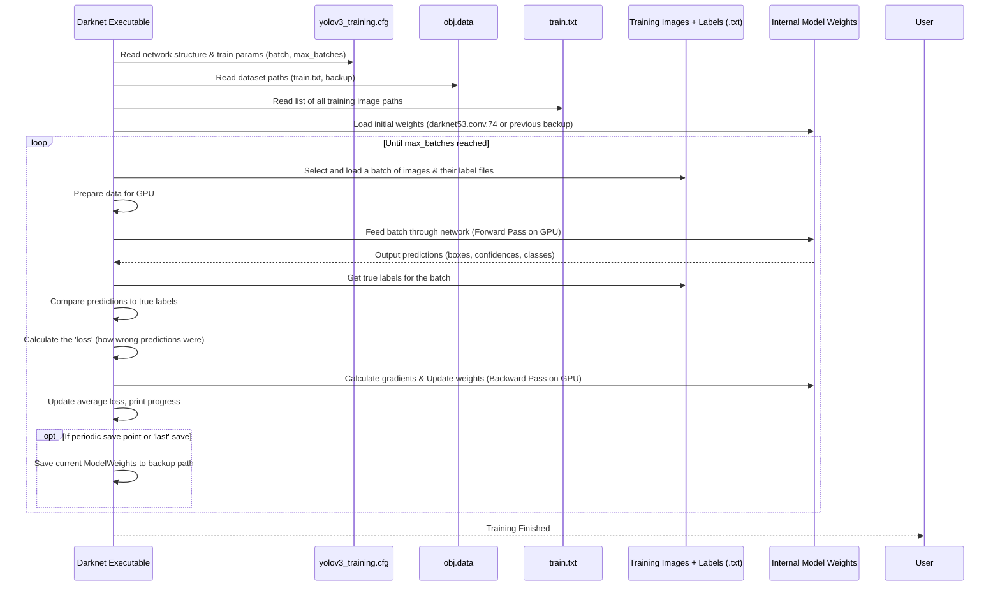

# Chapter 5: Training Process

Welcome back! In our previous chapters, we've set the stage for training our custom object detection model. We configured our workspace in [Chapter 1: Google Colab Environment](01_google_colab_environment_.md), told Darknet about our data and what objects to find in [Chapter 2: Dataset Configuration (.data, .names, train.txt)](02_dataset_configuration___data___names__train_txt__.md), configured the model's blueprint in [Chapter 3: YOLOv3 Model Configuration (.cfg)](03_yolov3_model_configuration___cfg__.md), and prepared the Darknet framework engine itself in [Chapter 4: Darknet Framework](04_darknet_framework_.md).

Now, it's time for the main event: **Training!**

### The Problem: Making the Model Learn

Imagine you have a puppy that needs to learn to fetch specific toys ("job" blocks and "beam_number" sticks, perhaps). Initially, the puppy doesn't know the difference. You have to show it examples: "This is a 'job' block," or "Go get the 'beam_number' stick!" When it brings back the wrong thing, you correct it. Over time, with many examples and corrections, the puppy learns to identify and fetch the right object.

Our YOLOv3 model is similar to that puppy. It starts with random internal numbers (weights) and doesn't know what a "job" or "beam_number" looks like. The **training process** is how we teach the model, using our dataset of images and their corresponding labels, to identify the objects we defined.

This is the phase where the model analyzes the training images, attempts to make predictions, compares those predictions to the correct labels (ground truth), calculates how wrong it was, and then adjusts its internal parameters (weights) to get a little bit better. This cycle repeats thousands of times until the model becomes proficient at locating and classifying our target objects.

### The Core Command: Starting the Engine

Everything we prepared in the previous steps culminates in a single command that tells the Darknet framework to start this iterative learning process. This command brings together the dataset configuration, the model configuration, and initial learned patterns from a pre-trained model.

Here is the command we run in Colab:

```bash
!./darknet detector train data/obj.data cfg/yolov3_training.cfg darknet53.conv.74 -dont_show
```

Let's break down each part of this crucial command, remembering what we learned in the previous chapters:

*   `!`: Tells Colab to execute this as a shell command.
*   `./darknet`: This is the executable Darknet program we compiled in [Chapter 4](04_darknet_framework_.md). The `./` means "look for it in the current directory" (which should be the `darknet` directory because we used `%cd darknet`).
*   `detector train`: These are subcommands telling the `darknet` program *what* to do. `detector` means we're working with object detection models, and `train` means we want to start the training procedure.
*   `data/obj.data`: This is the path to our dataset configuration file ([Chapter 2](02_dataset_configuration___data___names__train_txt__.md)). Darknet reads this first to know the number of classes, where the image lists (`train.txt`, `test.txt`) and names file (`obj.names`) are, and where to save the trained model weights.
*   `cfg/yolov3_training.cfg`: This is the path to our modified YOLOv3 model configuration file ([Chapter 3](03_yolov3_model_configuration___cfg__.md)). Darknet reads this to build the neural network structure itself, defining layers, sizes, batch parameters, learning rates, and the total number of training iterations (`max_batches`).
*   `darknet53.conv.74`: This is the path to the file containing pre-trained weights for a large portion of the YOLOv3 network. These weights come from training on a massive dataset (like ImageNet). Using these as a starting point, instead of random weights, helps our model learn much faster and often achieve better results, especially with smaller custom datasets. This technique is called **transfer learning**.
*   `-dont_show`: This is an optional flag. In some environments, Darknet might try to pop up a window to visualize the training process or detections. Since Colab is a cloud environment without a display, this flag prevents those windows from appearing, which would otherwise cause an error.

When you run this code cell, Darknet will start the training process.

### What You'll See During Training

Once the command starts, the Colab cell will begin outputting information printed by the Darknet framework. This output shows the progress of the training process. It will look like a stream of text, updating periodically.

Here's a simplified look at what some of the output lines mean:

```
Loading weights from darknet53.conv.74... Done!
Learning Rate: 0.001
Batch #    1,    1.973020 avg, 0.134516 rate , 2.643892 seconds , 64 images
Batch #    2,    1.859411 avg, 0.141291 rate , 2.540123 seconds , 128 images
Batch #    3,    1.745801 avg, 0.131418 rate , 2.687651 seconds , 192 images
...
Region Avg IOU: 0.781737, Class: 0.998916, Obj: 0.999353, No Obj: 0.000216, Avg Recall: 0.987805, Avg Precision: 0.990000, Avg F1: 0.988902, Loss: 1.245678, Vloss: 0.123456, .5R: 1.000000, .7R: 0.975610, count: 82
Batch #  100,    1.156789 avg, 0.128975 rate , 2.756789 seconds , 6400 images
... (many more lines)
```

Key things to look for:

1.  **`Batch #`**: This indicates the current training iteration or step. Darknet will train for `max_batches` total iterations (which we set to 4000 in [Chapter 3](03_yolov3_model_configuration___cfg__.md)).
2.  **`avg`**: This is the **average loss**. The 'loss' is a number that tells us how "wrong" the model's predictions were in the current batch of images. A lower loss means better predictions. The `avg` loss is a smoothed average over previous batches. **This number should generally decrease over time** as the model learns. Watching the `avg` loss go down is how you know your training is progressing well.
3.  **`rate`**: The learning rate, which controls how big of a step the model takes when adjusting its weights based on the loss.
4.  **`seconds`**: Time taken for the current batch.
5.  **`images`**: Total number of images processed so far.
6.  **`Loss`**: The loss calculated for the current batch.
7.  Other metrics like `Avg IOU`, `Class`, `Obj`, `Avg Recall`, `Avg Precision` provide more detailed insights into performance, but for beginners, focusing on the `avg` loss decreasing is the most important indicator of successful training.

Darknet will print this information periodically (e.g., every 10 or 100 batches).

### Saving Progress: Weights Files

Training can take a significant amount of time (minutes to hours depending on dataset size and `max_batches`). It's important to save the model's learned weights regularly so you don't lose progress if your Colab session disconnects or the training stops.

Darknet does this automatically! Based on the `backup = /content/weight` line in our `data/obj.data` file ([Chapter 2](02_dataset_configuration___data___names__train_txt__.md)), Darknet will save weight files periodically in a directory it creates named `weight` inside the `/content/` directory (which is inside the temporary Colab VM).

It typically saves:
*   Weights every 100 iterations for the first 1000 iterations (e.g., `yolov3_training_100.weights`, `yolov3_training_200.weights`, ...).
*   Weights every 1000 iterations after that.
*   A file named `yolov3_training_last.weights` very frequently. This file contains the weights from the *most recent* training batch.

**Important:** As noted in [Chapter 2](02_dataset_configuration___data___names__train_txt__.md), the path `/content/weight` is temporary. To save your weights permanently, you would typically change the `backup` path in `data/obj.data` to point to a location in your mounted Google Drive, like `/content/gdrive/MyDrive/Yolo_v3/backup_weights`. You would also need to create this directory in Google Drive before starting training.

### Stopping and Resuming Training

*   **Stopping:** You can stop the training process manually by clicking the square "Stop" button in the top left of the Colab cell that is running the training command, or by pressing `Ctrl + C` if you were running from a terminal. Darknet will usually print a message indicating it is saving the final weights before exiting.
*   **Resuming:** If your training stopped before reaching `max_batches`, you can resume it from the last saved weights. The project snippet includes a commented-out line for this:

    ```bash
    # Uncomment below and comment above to re-start your training from last saved weights
    #!./darknet detector train data/obj.data cfg/yolov3_training.cfg /mydrive/yolov3/yolov3_training_last.weights -dont_show
    ```
    To use this, you would:
    1.  Add a `#` symbol at the beginning of the first training command line to "comment it out" (make it inactive).
    2.  Remove the `#` symbol from the beginning of the second command line to "uncomment it" (make it active).
    3.  **Crucially, update the path `/mydrive/yolov3/yolov3_training_last.weights`** to the actual path in your Google Drive where `yolov3_training_last.weights` was saved. For example, if you updated your `.data` file's backup path to `/content/gdrive/MyDrive/Yolo_v3/backup_weights`, the path here would be `/content/gdrive/MyDrive/Yolo_v3/backup_weights/yolov3_training_last.weights`. If you used the default `/content/weight` (temporary), you wouldn't be able to resume after the Colab session ends.
    4.  Run the cell again.

    When you resume, Darknet loads the specified weights and continues training from where it left off, using the same `max_batches` limit defined in the `.cfg` file.

### Under the Hood: The Training Loop

When you run the training command, the Darknet framework orchestrates the entire process. Here's a simplified look at the core steps it performs in a loop:



This loop runs continuously, powered by the GPU, for the number of iterations specified by `max_batches`. Each iteration (batch) allows the model to see more examples and fine-tune its ability to detect your specific objects.

### Analogy Continued

Following our construction analogy:

*   Running the train command (`!./darknet detector train ...`): This is like the project manager giving the green light to the construction team (Darknet) to *start building*. They are given the full blueprint (`.cfg`), the list of materials and where to find them (`.data`, `train.txt`, images), and some partially pre-built components (`darknet53.conv.74` weights).
*   The Training Output (`Batch #`, `avg`): This is like the project manager getting progress reports from the site – "We finished batch #X, the average error finding objects was Y (and it's going down!), saving current progress..."
*   Saving Weights: This is like the construction team periodically creating a detailed snapshot of the building's state and putting it in storage (the `backup` folder) in case work needs to pause and resume later.
*   Stopping and Resuming: Stopping is pausing the construction. Resuming is bringing the team back, giving them the *latest* saved snapshot (`yolov3_training_last.weights`), and telling them to continue building towards the final goal (`max_batches`).

The training process is the actual work phase where the neural network model actively learns from your data under the guidance of the Darknet framework, transforming from a blank slate (or a general-purpose pre-trained model) into a specialized detector for your custom objects.

### Conclusion

In this chapter, we initiated the core training process using the Darknet framework. We executed the main training command, understood its components (pointing to the `.data`, `.cfg`, and initial weights files), and learned what to expect in the output (primarily watching the average loss decrease). We also discussed how Darknet saves progress through weights files and how to resume training if needed.

With training underway (or completed!), the next logical step is to use the model you've trained to actually detect objects in new images.

Let's move on to the next steps, which would involve using the trained weights for detection. (As per the project structure provided, the next chapter might cover detection or analysis).

---
