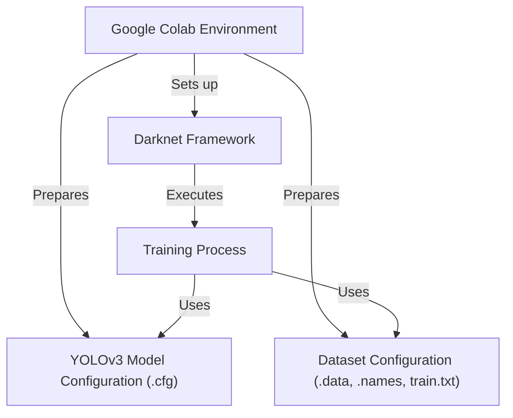

# Tutorial: yolov3

This project provides a guide and code to *train your own custom object detection model* using the powerful **YOLOv3** system.
It leverages the **Darknet Framework** engine and runs the entire **Training Process** within the **Google Colab Environment**,
allowing you to configure the model structure and dataset details using **Configuration Files**.

## Visual Overview

## Chapters

1. [Google Colab Environment
](01_google_colab_environment_.md)
2. [Dataset Configuration (.data, .names, train.txt)
](02_dataset_configuration___data___names__train_txt__.md)
3. [YOLOv3 Model Configuration (.cfg)
](03_yolov3_model_configuration___cfg__.md)
4. [Darknet Framework
](04_darknet_framework_.md)
5. [Training Process
](05_training_process_.md)

---
