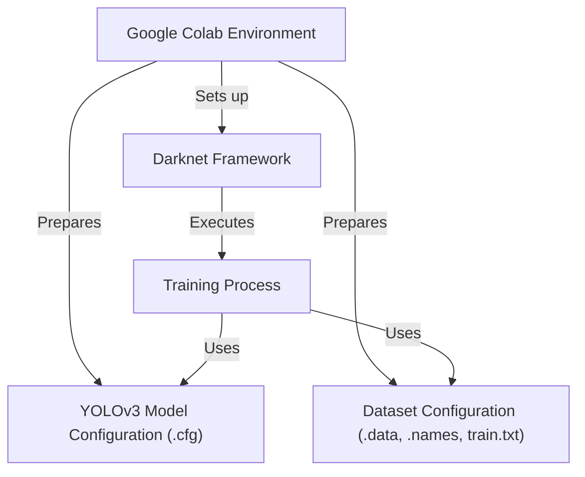
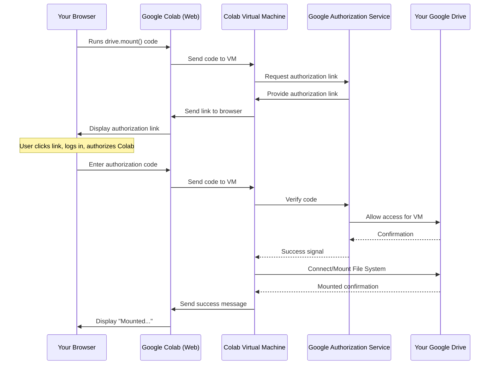
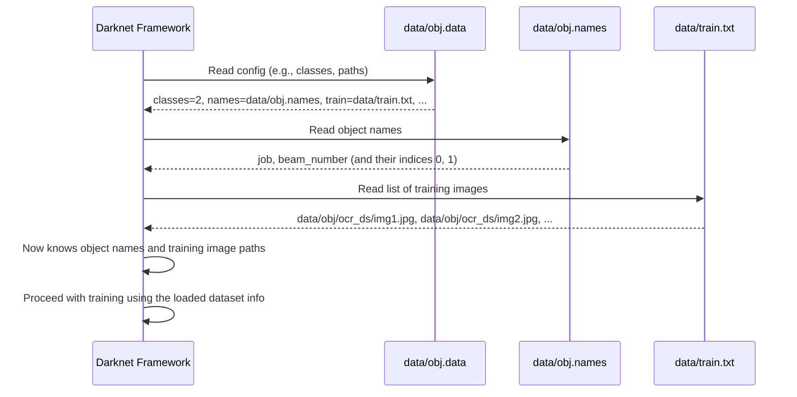
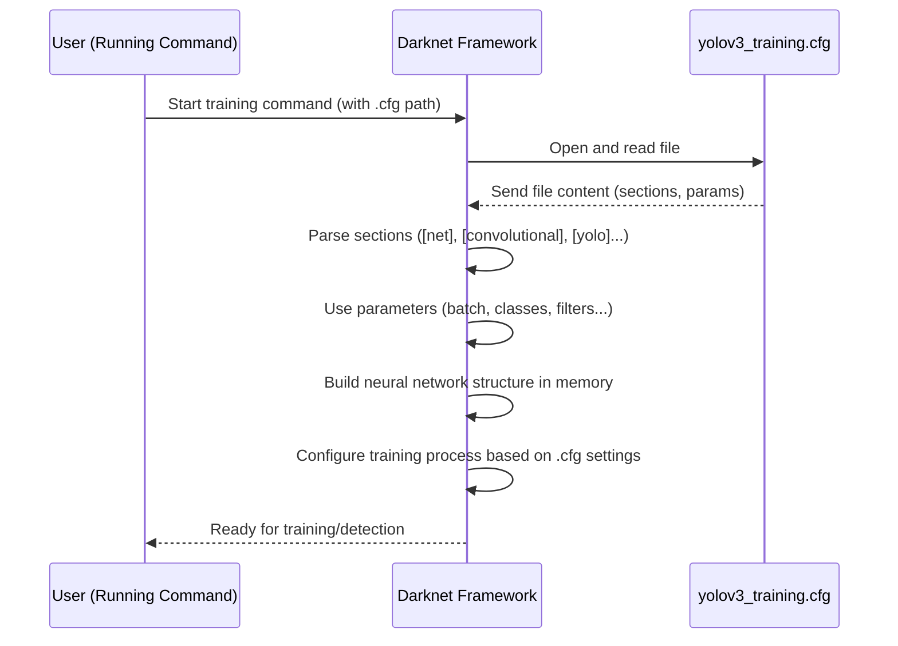
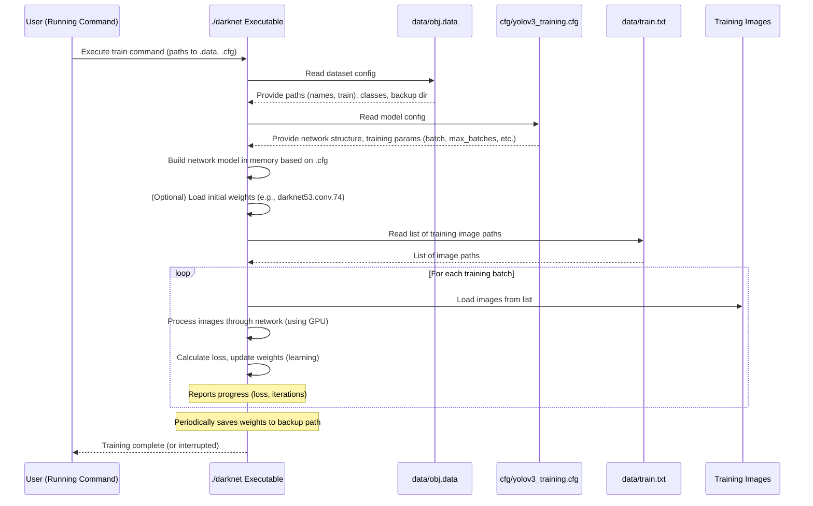
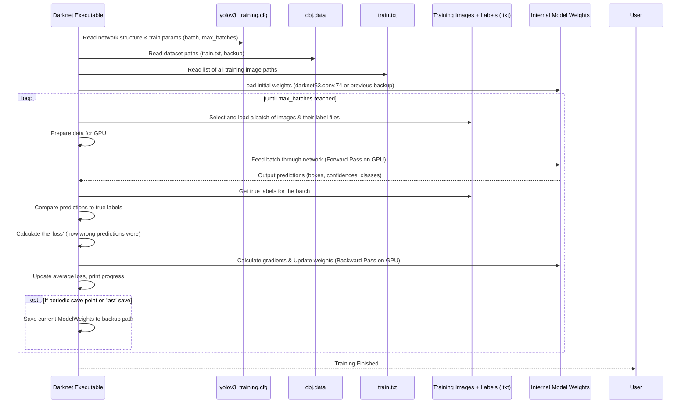

# Tutorial: yolov3

This project provides a guide and code to *train your own custom object detection model* using the powerful **YOLOv3** system.
It leverages the **Darknet Framework** engine and runs the entire **Training Process** within the **Google Colab Environment**,
allowing you to configure the model structure and dataset details using **Configuration Files**.


## Visual Overview



## Chapters

1. [Google Colab Environment
](01_google_colab_environment_.md)
2. [Dataset Configuration (.data, .names, train.txt)
](02_dataset_configuration___data___names__train_txt__.md)
3. [YOLOv3 Model Configuration (.cfg)
](03_yolov3_model_configuration___cfg__.md)
4. [Darknet Framework
](04_darknet_framework_.md)
5. [Training Process
](05_training_process_.md)

---
# Chapter 1: Google Colab Environment

Welcome to the first chapter of our YOLOv3 object detection tutorial! In this chapter, we'll get started with the platform where we'll be doing all our work: **Google Colab**. Think of it as your free workspace in the cloud, specially equipped for tasks like training powerful neural networks.

### What is Google Colab and Why Use It?

Training a complex neural network model like YOLOv3 requires a lot of computational power. Specifically, it benefits greatly from using a **Graphics Processing Unit (GPU)**. GPUs are like super-fast number crunchers that can handle the massive calculations needed for deep learning much faster than a standard computer's processor (CPU).

However, powerful GPUs can be expensive. This is where Google Colab comes in!

**Google Colab (or Colaboratory)** is a free, cloud-based service offered by Google that provides a ready-to-use environment for running Python code. The best part is that it offers **free access to GPUs**! This makes it an ideal platform for anyone wanting to learn and experiment with deep learning without investing in expensive hardware.

In short, we use Google Colab because:
1.  It's **free** to use.
2.  It provides access to **GPUs**, which are crucial for speeding up YOLOv3 training.
3.  It's a **notebook environment**, meaning you can mix code, explanations (like this tutorial!), and results in one place, making it easy to follow along step-by-step.

Our main goal in this chapter is to get our Colab environment ready for the project by ensuring we have a GPU and can save our work.

### Getting Started with Colab

To begin, you'll need a Google account.

1.  Go to the Google Colab website: [https://colab.research.google.com/](https://colab.research.google.com/)
2.  Create a new notebook (File > New notebook).
3.  **Crucially, enable the GPU runtime:** Go to the "Runtime" menu, select "Change runtime type", and under "Hardware accelerator", choose "GPU". Then click "Save". This connects your notebook to a virtual machine with a GPU.

Now you have a Colab notebook open and ready! The notebook consists of **code cells** (where you write and run code) and **text cells** (like this one, where you can add explanations).

### Verifying GPU Availability

Before we do anything else, let's check if our Colab notebook is indeed connected to a GPU. We can use a simple command-line tool called `nvidia-smi` (NVIDIA System Management Interface) for this.

In a code cell, type the following and press the "Run" button (the play icon) or `Shift + Enter`:

```bash
!nvidia-smi
```

The `!` at the beginning tells Colab to run this command as if you were typing it in a terminal, not as Python code. `nvidia-smi` is a command available in the Colab environment that shows information about the NVIDIA GPU attached.

**What to Expect:**

If a GPU is available and set up correctly, the output will look something like this (details may vary based on the exact GPU model provided by Colab):

```
+-----------------------------------------------------------------------------+
| NVIDIA-SMI 460.32.03    Driver Version: 460.32.03    CUDA Version: 11.2     |
|-------------------------------+----------------------+----------------------+
| GPU  Name        Persistence-M| Bus-Id        Disp.A | Volatile Uncorr. ECC |
| Fan  Temp  Perf  Pwr:Usage/Cap|         Memory usage | GPU-Util  Compute M. |
|                               |                      |               MIG M. |
|===============================+======================+======================|
|   0  Tesla T4            Off  | 00000000:00:04.0 Off |                    0 |
| N/A   39C    P8     9W / 70W |      0MiB / 15109MiB |      0%      Default |
|                               |                      |                  N/A |
+-------------------------------+----------------------+----------------------+
... (other process info)
```

The key information here is the **GPU Name** (e.g., `Tesla T4`) and the **Memory usage**. If you see a table like this, congratulations, your Colab environment has a GPU ready for action! If you see an error or information about CPU, double-check that you selected "GPU" in the runtime settings.

### Saving Your Work Permanently: Mounting Google Drive

Google Colab notebooks run on temporary virtual machines. This means that any files you download or create (like your dataset, model configuration, or trained weights) will be **deleted** when the session ends (after a period of inactivity or if you close the browser tab).

To avoid losing your progress and files, we need to connect your Colab environment to your Google Drive. This is called **mounting Google Drive**.

In a new code cell, run the following code:

```python
from google.colab import drive
drive.mount('/content/gdrive')
```

**What Happens When You Run This:**

1.  This code imports the necessary function (`drive`) from Colab's libraries.
2.  `drive.mount('/content/gdrive')` initiates the mounting process.
3.  Colab will provide a link asking you to authorize it to access your Google Drive.
4.  Click the link, select your Google account, and grant the permissions.
5.  Google will give you an authorization code. Copy this code.
6.  Go back to your Colab notebook and paste the code into the input box that appears below the code cell.
7.  Press Enter.

You should see a message like `Mounted at /content/gdrive`. This means your Google Drive is now accessible from within your Colab notebook at the path `/content/gdrive`.

You can navigate your Google Drive files within the Colab file explorer (the folder icon on the left sidebar) under the `/content/gdrive` directory. You can now save important files here, and they will persist even after your Colab session ends.

### How It Works: Behind the Scenes

When you run a code cell in Colab:

1.  Your web browser (running the Colab frontend) sends the code to Google's servers.
2.  Google allocates a **virtual machine (VM)** for your session (the Colab backend). This VM is like a temporary computer just for you. If you chose the GPU runtime, this VM has access to a GPU.
3.  The code is executed on this VM.
    *   Python code runs directly.
    *   Commands starting with `!` are run in the VM's shell (like a command prompt).
    *   The `drive.mount()` command uses special Colab-specific tools within the VM to establish a secure connection to your Google Drive account based on the authorization code you provide.
4.  The output (text, errors, etc.) is sent back to your browser and displayed in the output area of the code cell.

Here's a simplified diagram of the mounting process:



Now, your Colab VM can read and write files directly in your Google Drive folder `/content/gdrive`.

### Conclusion

In this chapter, we learned what Google Colab is and why it's essential for training YOLOv3 models (thanks to free GPU access!). We set up our environment by enabling the GPU runtime, verified it using `!nvidia-smi`, and connected our Google Drive using `drive.mount()` to ensure our data and results are saved.

With our powerful cloud environment ready, the next step is to understand the building blocks of our project's data.

Let's move on to [Chapter 2: Dataset Configuration (.data, .names, train.txt)](02_dataset_configuration___data___names__train_txt__.md).

---

# Chapter 2: Dataset Configuration (.data, .names, train.txt)

Welcome back! In [Chapter 1: Google Colab Environment](01_google_colab_environment_.md), we got our powerful workspace set up in the cloud with GPU access and learned how to save our work using Google Drive. Now that we have our environment ready, it's time to tell the YOLOv3 system what we actually want it to find in images and where to find those images.

Think of this chapter as creating the "instruction manual" for our object detection project. Specifically, we need to configure three crucial files: `.data`, `.names`, and `train.txt`. These files tell the Darknet framework (the software that runs YOLOv3) everything it needs to know about the dataset we want to use for training.

### The Problem: Darknet Needs to Know Your Data

YOLOv3 is a general-purpose object detector, but to make it find *your* specific objects (like "job" and "beam_number" from our example), you need to provide it with examples (your dataset) and clearly define what those objects are. Darknet can't magically know that a certain bounding box in an image corresponds to a "job" unless you tell it.

So, how do we communicate our custom dataset details to Darknet?

This is where the `.data`, `.names`, and `train.txt` files come in. They act as the bridge between your prepared images and annotations and the Darknet training process.

Let's break down what each file does.

### 1. The `.names` File: Listing Your Object Names

The `.names` file is the simplest of the three. Its only job is to list the names of the objects (or classes) that you want YOLOv3 to detect, one name per line. The order matters! Darknet assigns an index (starting from 0) to each name based on its line number.

**Why is this needed?** When you train YOLOv3, it learns to recognize patterns associated with each object type. It needs to know the human-readable names for these types.

For our example, we are training the model to find two specific things: "job" and "beam_number".

Here's how we create the `data/obj.names` file with these names in our Colab environment (using the commands from the project's setup):

```bash
!echo -e 'job\nbeam_number' > data/obj.names
```

*   `!` at the start tells Colab to run this as a shell command.
*   `echo -e 'job\nbeam_number'` prints the text 'job', then a newline character (`\n`), then the text 'beam_number'.
*   `>` redirects this output into a file named `data/obj.names`. This file will be created inside the `darknet` directory we cloned in Chapter 1, specifically in the `data` subfolder.

After running this, if you were to look at the contents of `data/obj.names`, it would look like this:

```
job
beam_number
```

Now Darknet knows that index `0` corresponds to "job" and index `1` corresponds to "beam_number".

### 2. The `.data` File: The Main Configuration Hub

The `.data` file is like the central settings file for your dataset configuration. It tells Darknet key information, such as:

*   How many different types of objects are there?
*   Where is the list of training images?
*   Where is the list of validation (or testing) images? (Validation images are used to evaluate the model's performance during training, but aren't used for the training itself).
*   Where is the `.names` file we just created?
*   Where should the trained model files (weights) be saved?

**Why is this needed?** Darknet needs a single place to look up all the essential paths and parameters related to your specific dataset.

Here's the command to create our `data/obj.data` file based on the project's setup:

```bash
!echo -e 'classes= 2\ntrain  = data/train.txt\nvalid  = data/test.txt\nnames = data/obj.names\nbackup = /content/weight' > data/obj.data
```

Let's break down the lines in this file:

*   `classes = 2`: This tells Darknet there are 2 different object classes it needs to detect (`job` and `beam_number`). This number *must* match the number of lines in your `.names` file.
*   `train = data/train.txt`: This specifies the path to the file that lists all your training images. We'll create this file next. The path `data/train.txt` is relative to the `darknet` directory.
*   `valid = data/test.txt`: This specifies the path to the file that lists your validation images. The project snippet uses `data/test.txt`. For this basic tutorial, we might not use a separate validation set, or the `test.txt` file might be empty or list just a few images for quick checks. For larger, real-world projects, you would split your dataset into training and validation sets and list the validation image paths here.
*   `names = data/obj.names`: This provides the path to the `.names` file we just created.
*   `backup = /content/weight`: This tells Darknet where to save the model's weights files periodically during training. If you want to save your trained model files persistently (so they don't disappear when your Colab session ends), you should change this path to point to a folder in your Google Drive, for example, `/content/gdrive/MyDrive/Yolo_v3/backup_weights`. *Note: The project's snippet saves configuration files to Google Drive later, but the `.data` file itself specifies a temporary Colab path for weights. For persistence, you'd typically modify this line.*

After running this command, the contents of `data/obj.data` will look like this:

```
classes= 2
train  = data/train.txt
valid  = data/test.txt
names = data/obj.names
backup = /content/weight
```

### 3. The `train.txt` File: Listing Your Training Images

The `train.txt` file is simply a text file where each line is the full path to one of your training images.

**Why is this needed?** Darknet doesn't automatically scan folders for images. It needs an explicit list of *which* images to use for training. This file provides that list.

Creating this file involves listing all your training images and writing their paths into `data/train.txt`. Our project snippet assumes your images are unzipped into the `data/obj/ocr_ds/` directory within the `darknet` folder. It uses a Python script to find all `.jpg` files in that location and write their paths to `train.txt`.

Here's the Python code used (which is run in a Colab code cell):

```python
import glob

# Find all .jpg files in the specified directory
images_list = glob.glob("data/obj/ocr_ds/*.jpg")

# Open data/train.txt in write mode
with open("data/train.txt", "w") as f:
    # Join all image paths with a newline character in between
    f.write("\n".join(images_list))
```

*   `import glob`: This imports a Python module that helps find files based on patterns (like `*.jpg`).
*   `glob.glob("data/obj/ocr_ds/*.jpg")`: This finds all files ending with `.jpg` inside the `data/obj/ocr_ds/` directory and returns a list of their paths.
*   `with open("data/train.txt", "w") as f:`: This opens the file `data/train.txt` for writing (`"w"`). The `with` statement ensures the file is automatically closed afterward. The opened file is referred to by the variable `f`.
*   `f.write("\n".join(images_list))`: This takes the `images_list` (which is a Python list of file paths) and joins them together into a single string. It puts a newline character (`\n`) between each path. This string is then written to the `data/train.txt` file.

After running this code, `data/train.txt` will contain a list of image paths, looking something like this (with your actual image paths):

```
data/obj/ocr_ds/image_001.jpg
data/obj/ocr_ds/image_002.jpg
data/obj/ocr_ds/another_image.jpg
...
```

Now Darknet has the complete list of images to train on.

### How It All Fits Together: Darknet Reads the Instructions

When you start the Darknet training command later ([Chapter 5: Training Process](05_training_process_.md)), Darknet needs to load your dataset information. Here's the simplified flow of how it uses these three files:



This sequence shows how the `.data` file serves as the entry point, guiding Darknet to the other necessary files (`.names` and `train.txt`) to fully understand your custom dataset.

### Analogy

Imagine you're preparing to teach someone to identify specific types of fruits in pictures.

*   The `.names` file is like giving them a list of the names of the fruits they need to learn: "Apple", "Banana", "Orange".
*   The `train.txt` file is like giving them a physical pile of pictures, where each picture shows one or more of these fruits.
*   The `.data` file is like a note that says: "Okay, here's the list of fruit names (pointing to the names list). Here's the pile of pictures to study (pointing to the pile). There are 3 kinds of fruits to learn. When you're ready, save your study notes here (pointing to a backup folder)."

Without all three pieces of information linked correctly, the teaching (training) process can't begin!

### Conclusion

In this chapter, we configured the essential files that tell the Darknet framework about our custom dataset. We created:

*   `data/obj.names`: Listing the names of the objects we want to detect (`job`, `beam_number`).
*   `data/obj.data`: The main configuration file pointing to the number of classes, the names file, the list of training images, and where to save weights.
*   `data/train.txt`: A list of all the image files that Darknet should use for training.

These files provide Darknet with the fundamental information about *what* to detect and *where* the training examples are located. With the dataset defined, the next crucial step is to configure the YOLOv3 model itself for our specific task.

Let's move on to [Chapter 3: YOLOv3 Model Configuration (.cfg)](03_yolov3_model_configuration___cfg__.md).

---

# Chapter 3: YOLOv3 Model Configuration (.cfg)

Welcome back! In [Chapter 1: Google Colab Environment](01_google_colab_environment_.md), we set up our free cloud workspace. In [Chapter 2: Dataset Configuration (.data, .names, train.txt)](02_dataset_configuration___data___names__train_txt__.md), we told the Darknet framework *what* objects to look for and *where* to find the training images.

Now that Darknet knows about our data, it needs the instructions on how to build the actual neural network model that will learn to find those objects. This is where the **YOLOv3 model configuration file**, typically ending with `.cfg`, comes in.

### The Problem: The Default Model Isn't Built for Your Objects

The standard YOLOv3 model (often configured in a file called `yolov3.cfg`) is pre-configured to detect objects from a huge dataset called COCO, which has 80 different object classes (like person, car, dog, etc.).

However, our project focuses on detecting just two specific objects: "job" and "beam_number". We don't need a model configured for 80 classes; we need one specifically tailored for our 2 classes. We also might want to tweak some training settings like how many images the model processes at once.

The `.cfg` file is the blueprint that defines the entire structure of the YOLOv3 network – what types of layers it has (like convolutional layers that process images), how many of them, how they connect, and also contains crucial training parameters. We need to modify this blueprint to match our custom task.

### What is a `.cfg` File? The Model's Blueprint

Imagine you're building a complex machine. You'd need a detailed blueprint showing every part, how it's connected, and operational settings. The `.cfg` file is exactly that for the YOLOv3 neural network.

It's a plain text file containing different sections, where each section defines either a layer in the network or global configuration settings for training.

Here's a simplified look at what you might see inside (the actual file is much longer and more complex):

```
[net]       # Global network settings
batch=1     # Number of images per training batch
subdivisions=1 # Further split batches
width=416   # Input image width
height=416  # Input image height
channels=3  # Input image channels (RGB)
...
learning_rate=0.001
max_batches=500200 # How many training steps

[convolutional] # Example of a layer definition
filters=32
size=3
stride=1
pad=1
activation=leaky
...

[yolo] # The final prediction layer (there are multiple)
mask = 6,7,8
anchors = 10,13,  16,30,  33,23,  30,61,  62,45,  59,119,  116,90,  156,198,  373,326
classes=80 # << This needs changing for us!
...
```

Each `[section_name]` defines a block, and the lines below it set parameters for that block.

### Why We Modify the `.cfg` for Custom Training

We need to make specific changes to the default `yolov3.cfg` to adapt it for our 2-class dataset:

1.  **Number of Classes:** The most important change is telling the network how many objects it should try to detect. The default is 80 (for COCO); we need to change this to 2.
2.  **Number of Filters in Prediction Layers:** The final layers of the network that actually output the detection boxes and class probabilities (`[yolo]` layers) have a specific number of output "filters". This number is directly related to the number of classes. The formula used in Darknet for YOLOv3 is:
    `filters = (classes + 5) * 3`
    *   `classes`: The number of object classes you have.
    *   `5`: Represents the 4 bounding box coordinates (x, y, width, height) and 1 objectness score (confidence that an object is present).
    *   `3`: Represents the 3 anchor boxes used by each detection layer at each grid cell location.
    For 80 classes: `filters = (80 + 5) * 3 = 85 * 3 = 255`. This is why you see `filters=255` in the default config.
    For our 2 classes: `filters = (2 + 5) * 3 = 7 * 3 = 21`. We need to change `filters` to 21 in the relevant layers.
3.  **Training Parameters:** We might also want to adjust how the training runs, such as `batch` size, `subdivisions`, and `max_batches`.
    *   `batch`: Number of images processed in one go. Larger batches can sometimes lead to more stable training but require more GPU memory.
    *   `subdivisions`: Darknet splits the `batch` into smaller `subdivisions` that fit into GPU memory. The effective batch size is `batch / subdivisions`. We need to increase `batch` for better training and `subdivisions` to fit it into Colab's GPU memory.
    *   `max_batches`: The total number of training iterations (steps) the model will perform. The default is very high (500200) for the massive COCO dataset. For a smaller custom dataset, a lower number like 4000 or 6000 is often sufficient. A common rule of thumb is `max_batches = num_classes * 2000`, but this can vary. For our 2 classes, 4000 is a reasonable starting point.

### How to Modify the `.cfg` File

The project snippet uses command-line tools within Colab to modify a copy of the default `yolov3.cfg` file.

First, it makes a copy of the original file:

```bash
!cp cfg/yolov3.cfg cfg/yolov3_training.cfg
```

*   `!`: Run as a shell command.
*   `cp`: Copy command.
*   `cfg/yolov3.cfg`: Source file (the original default config).
*   `cfg/yolov3_training.cfg`: Destination file (our new config specifically for training). This keeps the original `yolov3.cfg` untouched.

Next, it uses the `sed` command to find and replace specific lines in the new `yolov3_training.cfg` file. `sed` is a powerful text manipulation tool. The `s/old_text/new_text/` part tells `sed` to substitute `old_text` with `new_text`.

Let's look at the `sed` commands used in the project:

```bash
# Change batch and subdivisions
!sed -i 's/batch=1/batch=64/' cfg/yolov3_training.cfg
!sed -i 's/subdivisions=1/subdivisions=16/' cfg/yolov3_training.cfg
```

*   `!sed -i`: Run `sed` with the `-i` option, which means edit the file in place.
*   `'s/batch=1/batch=64/'`: Finds the line `batch=1` and changes it to `batch=64`.
*   `'s/subdivisions=1/subdivisions=16/'`: Finds the line `subdivisions=1` and changes it to `subdivisions=16`.
    *   This sets the effective batch size to `64 / 16 = 4` images per GPU processing step.

```bash
# Change max_batches
!sed -i 's/max_batches = 500200/max_batches = 4000/' cfg/yolov3_training.cfg
```

*   `'s/max_batches = 500200/max_batches = 4000/'`: Changes the total number of training steps from the default 500200 to 4000.

```bash
# Change classes in the three [yolo] layers
!sed -i '610 s@classes=80@classes=2@' cfg/yolov3_training.cfg
!sed -i '696 s@classes=80@classes=2@' cfg/yolov3_training.cfg
!sed -i '783 s@classes=80@classes=2@' cfg/yolov3_training.cfg
```

*   `'610 s@classes=80@classes=2@'`: This is slightly different. `610` means apply this substitution only on line number 610. `s@classes=80@classes=2@` finds `classes=80` and replaces it with `classes=2`. We use `@` instead of `/` as the delimiter because the search pattern doesn't contain `@`.
*   YOLOv3 has three detection scales, each ending with a `[yolo]` layer. These `sed` commands target the `classes` parameter in each of these three `[yolo]` layers (which happen to be around lines 610, 696, and 783 in the standard `yolov3.cfg`).

```bash
# Change filters in the convolutional layer BEFORE each [yolo] layer
!sed -i '603 s@filters=255@filters=21@' cfg/yolov3_training.cfg
!sed -i '689 s@filters=255@filters=21@' cfg/yolov3_training.cfg
!sed -i '776 s@filters=255@filters=21@' cfg/yolov3_training.cfg
```

*   Similar to changing `classes`, these commands target the `filters` parameter in the `[convolutional]` layer that comes *just before* each of the three `[yolo]` layers (around lines 603, 689, and 776).
*   As calculated before, `(2 classes + 5) * 3 anchors = 21 filters`.

After running these commands, the `cfg/yolov3_training.cfg` file will be updated with the settings suitable for training on our 2-class dataset.

### Summarizing the Key Changes

Here's a summary of the important parameters changed for our 2-class custom training:

| Parameter     | Original Value (for COCO 80 classes) | New Value (for our 2 classes) | Why?                                                |
| :------------ | :----------------------------------- | :---------------------------- | :-------------------------------------------------- |
| `batch`       | 1                                    | 64                            | Increased for better training, effective batch 4.   |
| `subdivisions`| 1                                    | 16                            | To fit the larger batch into Colab GPU memory.      |
| `max_batches` | 500200                               | 4000                          | Sufficient iterations for a smaller custom dataset. |
| `classes`     | 80                                   | 2                             | To detect only our specific objects.                |
| `filters`     | 255                                  | 21                            | Output size must match `(classes + 5) * 3`.         |

### How Darknet Uses the `.cfg` File (Under the Hood)

When you start training or detection using Darknet, it first reads the specified `.cfg` file.

1.  **File Parsing:** Darknet opens the `.cfg` file and reads it line by line.
2.  **Layer Definition:** When it encounters a line like `[convolutional]` or `[yolo]`, it understands that a new network layer or block is being defined. It then reads the parameters below that section (`filters`, `size`, `classes`, etc.).
3.  **Network Construction:** Based on these definitions, Darknet dynamically builds the neural network model in memory. It allocates space for the weights (the numbers the network will learn) according to the `filters` and other size parameters specified.
4.  **Parameter Loading:** Global parameters like `batch`, `max_batches`, `learning_rate` are read and stored for use during the training loop.
5.  **Training/Inference Setup:** With the network structure built and parameters loaded, Darknet is ready to start either the training process (using the dataset info from the `.data` file and images from `train.txt`) or perform detection on a new image.

Here's a simple sequence:



This blueprint step is crucial because it tells Darknet the exact architecture and settings it needs to use to train your object detection model for *your specific task* with the correct number of classes and optimized training flow.

### Analogy

If the `.data`, `.names`, and `train.txt` files are like telling someone *what* fruits to identify and *where* to find the pictures, the `.cfg` file is like giving them the specific "visual guide" (the neural network structure) they should use, detailing how many layers of visual analysis to perform, how many different fruit types to prepare for, and how long they should study (max\_batches).

### Conclusion

In this chapter, we learned that the `.cfg` file is the detailed blueprint for the YOLOv3 neural network model. We understood why the default configuration needs modification for a custom dataset and saw how to change key parameters like `classes`, `filters`, `batch`, `subdivisions`, and `max_batches` using command-line tools.

With the dataset information configured in [Chapter 2](02_dataset_configuration___data___names__train_txt__.md) and the model structure defined in this chapter, we now have the two main configuration pieces ready. The next step is to understand the software that brings it all together – the Darknet framework itself.

Let's move on to [Chapter 4: Darknet Framework](04_darknet_framework_.md).

---
# Chapter 4: Darknet Framework

Welcome back! So far in our journey, we've set up our powerful cloud workspace in [Chapter 1: Google Colab Environment](01_google_colab_environment_.md), defined *what* objects we want to detect and *where* to find the training data in [Chapter 2: Dataset Configuration (.data, .names, train.txt)](02_dataset_configuration___data___names__train_txt__.md), and configured the *blueprint* for our YOLOv3 model itself in [Chapter 3: YOLOv3 Model Configuration (.cfg)](03_yolov3_model_configuration___cfg__.md).

But who actually *does* the heavy lifting? Who reads these configuration files, processes the images, builds the neural network according to the blueprint, and performs the complex calculations required for training and detection?

This is the job of the **Darknet Framework**.

### What is Darknet? The Engine of YOLOv3

Think of Darknet as the specialized software application or engine that powers YOLO. It's a command-line framework, primarily written in the C programming language (known for its speed and efficiency), specifically designed to build, train, and run neural networks, especially YOLO.

If our `.cfg` file is the blueprint of the building (the network) and our `.data` file and images are the materials, then **Darknet is the construction team with all their specialized tools and machinery**. You give Darknet the blueprint and the materials, and it constructs the building and gets it ready for use (training/detection).

It doesn't have a fancy graphical interface; you interact with it by typing commands into a terminal or, in our case, using the `!` prefix in Colab code cells to run shell commands.

### Why Use Darknet for YOLOv3?

YOLO was originally developed and released alongside the Darknet framework by the same creators (Joseph Redmon and Ali Farhadi). Darknet was built from the ground up with YOLO in mind, making it highly optimized for this specific architecture. While YOLO can now be used with other frameworks like TensorFlow or PyTorch, using Darknet is often considered the native and highly efficient way, especially for certain versions like YOLOv3. Its C implementation allows it to work very closely with the GPU for maximum speed.

### How We Interact with Darknet in Colab

In Google Colab, we don't run Darknet by clicking icons. We use shell commands, just like you would in a Linux terminal. The `!` or `%cd` commands in Colab allow us to execute these commands directly on the virtual machine.

Our Colab notebook essentially guides Darknet through a series of steps:

1.  **Get the Darknet software:** Download the Darknet source code.
2.  **Configure Darknet:** Tell Darknet how to prepare itself for our Colab environment (especially to use the GPU).
3.  **Build Darknet:** Compile the source code into an executable program.
4.  **Run Darknet:** Execute the program with specific commands to perform tasks like training or detection, pointing it to the configuration and data files we prepared.

Let's look at the Colab code snippets that demonstrate these interactions, linking them back to the actions we saw in the project notebook.

### 1. Getting Darknet: Cloning the Repository

The first interaction is getting the Darknet code itself. We use `git clone` to download it from its source on GitHub.

```bash
# Clone the Darknet repository
!git clone https://github.com/AlexeyAB/darknet
```

*   `!`: Run this as a shell command.
*   `git clone`: Standard command to download a Git repository.
*   `https://github.com/AlexeyAB/darknet`: The web address where the Darknet code is stored.

After running this, a folder named `darknet` appears in our Colab file system, containing all the Darknet source code files.

Then, we change our current directory to this new `darknet` folder so subsequent commands run from inside it:

```bash
# Change into the darknet directory
%cd darknet
```

*   `%cd`: A special Colab command (also works in IPython/Jupyter) to change the current working directory. This is equivalent to the shell command `cd`.
*   `darknet`: The name of the folder we just cloned.

### 2. Configuring Darknet: Modifying the Makefile

Darknet needs to be compiled (built) into a program that can run on our specific system. The `Makefile` contains instructions for this build process. We need to edit this file to enable GPU support, CUDA Deep Neural Network library (CUDNN) support (which speeds up training on GPUs), and OpenCV support (for image loading/saving).

We use the `sed` command to make these changes directly in the `Makefile`.

```bash
# Enable OpenCV, GPU, and CUDNN in the Makefile
!sed -i 's/OPENCV=0/OPENCV=1/' Makefile
!sed -i 's/GPU=0/GPU=1/' Makefile
!sed -i 's/CUDNN=0/CUDNN=1/' Makefile
```

*   `!`: Run as shell command.
*   `sed -i`: Use `sed` to edit the file in place (`-i`).
*   `'s/OPENCV=0/OPENCV=1/' Makefile`: Find the line `OPENCV=0` and replace it with `OPENCV=1` in the file `Makefile`. Similar changes are made for `GPU` and `CUDNN`.

These simple edits tell the Darknet build system to include support for these crucial libraries when it compiles the code.

### 3. Building Darknet: The `make` Command

Now that we've configured the build instructions in the `Makefile`, we can run the `make` command. This command reads the `Makefile` and executes the steps needed to compile the Darknet source code files (which are written in C) into a runnable program.

```bash
# Compile Darknet
!make
```

*   `!`: Run as shell command.
*   `make`: Execute the build process defined in the `Makefile`.

This step takes a little time. You'll see a lot of output in the Colab cell as the compiler works. If successful, this will create an executable file named `./darknet` inside the `darknet` directory. This is the main program we will use.

### 4. Running Darknet: Training and Detection Commands

With the `./darknet` executable ready, we can now give it commands to perform tasks like training our model or detecting objects in an image.

The most important command for training is:

```bash
# Start training using the configured files
!./darknet detector train data/obj.data cfg/yolov3_training.cfg darknet53.conv.74 -dont_show
```

Let's break this down:

*   `!`: Run as shell command.
*   `./darknet`: Execute the Darknet program located in the current directory (`./`).
*   `detector`: A subcommand telling Darknet we want to use its object detection capabilities.
*   `train`: A subcommand specifically for the training process.
*   `data/obj.data`: The path to our dataset configuration file ([Chapter 2](02_dataset_configuration___data___names__train_txt__.md)). Darknet reads this first to find out about our classes, names file, train list, etc.
*   `cfg/yolov3_training.cfg`: The path to our model configuration file ([Chapter 3](03_yolov3_model_configuration___cfg__.md)). Darknet reads this to build the network architecture and get training parameters.
*   `darknet53.conv.74`: The path to a file containing pre-trained weights for the main part of the network. Using these weights from a model trained on a huge dataset (like ImageNet) helps speed up training on our smaller custom dataset (this is called transfer learning).
*   `-dont_show`: An option to prevent Darknet from trying to open graphical windows (which doesn't work in Colab).

This single command launches the entire training process, orchestrated by the Darknet framework using the inputs (`.data`, `.cfg`, weights) we've prepared.

Here's a table summarizing our interactions:

| Colab Command(s)                     | What It Does                                  | Why We Do It                                           | Darknet's Role            |
| :----------------------------------- | :-------------------------------------------- | :----------------------------------------------------- | :------------------------ |
| `!git clone ...`, `%cd darknet`      | Gets the Darknet source code & moves into dir | We need the program files.                             | Provides the source code. |
| `!sed -i ... Makefile`               | Edits the build instructions                  | To enable GPU, CUDNN, OpenCV support for Colab.        | Follows instructions.     |
| `!make`                              | Compiles the source code into a program       | To create the executable we can run.                   | Performs compilation.     |
| `!./darknet detector train ...`      | Starts the training process                   | To train our object detection model on our data.       | The "engine" running the training loop. |

### How Darknet Works When You Run a Command (Simplified)

When you execute a complex command like `./darknet detector train data/obj.data cfg/yolov3_training.cfg ...`, the Darknet framework follows a sequence of steps:



This diagram shows how the Darknet executable acts as the central controller. It first gathers all the necessary information from the configuration files we prepared and then uses this information to manage the actual training process, involving loading images, running the network, and updating the model's weights.

### Analogy Continued

If the `.cfg` is the blueprint and the `.data`/dataset is the materials, **Darknet is the entire construction site operation**.

*   Getting Darknet (`git clone`, `make`): Setting up the construction site, bringing in the machinery, and getting it ready to operate.
*   Configuring Darknet (`Makefile` edits): Adjusting the machinery settings for the specific conditions of *this* job site (Colab with GPU).
*   Running Darknet (`./darknet detector train ...`): Starting the construction process, where Darknet (the machinery and crew) uses the blueprint (`.cfg`) and materials (`.data`, images) to build and refine the structure (the trained model).

Darknet is the bridge that connects your data and your model's definition to the actual computation of training a neural network.

### Conclusion

In this chapter, we met the Darknet framework – the core engine written in C that does the heavy lifting for training and running YOLO models. We learned how we interact with it in our Colab environment using shell commands to clone its code, configure it for our GPU, compile it into an executable program, and finally, run that program to start the training process using the `.data` and `.cfg` files we prepared in the previous chapters.

With Darknet ready and configured to use our dataset and model blueprint, we are now prepared to actually start the process of teaching the model to detect our custom objects.

Let's move on to [Chapter 5: Training Process](05_training_process_.md).

---
# Chapter 5: Training Process

Welcome back! In our previous chapters, we've set the stage for training our custom object detection model. We configured our workspace in [Chapter 1: Google Colab Environment](01_google_colab_environment_.md), told Darknet about our data and what objects to find in [Chapter 2: Dataset Configuration (.data, .names, train.txt)](02_dataset_configuration___data___names__train_txt__.md), configured the model's blueprint in [Chapter 3: YOLOv3 Model Configuration (.cfg)](03_yolov3_model_configuration___cfg__.md), and prepared the Darknet framework engine itself in [Chapter 4: Darknet Framework](04_darknet_framework_.md).

Now, it's time for the main event: **Training!**

### The Problem: Making the Model Learn

Imagine you have a puppy that needs to learn to fetch specific toys ("job" blocks and "beam_number" sticks, perhaps). Initially, the puppy doesn't know the difference. You have to show it examples: "This is a 'job' block," or "Go get the 'beam_number' stick!" When it brings back the wrong thing, you correct it. Over time, with many examples and corrections, the puppy learns to identify and fetch the right object.

Our YOLOv3 model is similar to that puppy. It starts with random internal numbers (weights) and doesn't know what a "job" or "beam_number" looks like. The **training process** is how we teach the model, using our dataset of images and their corresponding labels, to identify the objects we defined.

This is the phase where the model analyzes the training images, attempts to make predictions, compares those predictions to the correct labels (ground truth), calculates how wrong it was, and then adjusts its internal parameters (weights) to get a little bit better. This cycle repeats thousands of times until the model becomes proficient at locating and classifying our target objects.

### The Core Command: Starting the Engine

Everything we prepared in the previous steps culminates in a single command that tells the Darknet framework to start this iterative learning process. This command brings together the dataset configuration, the model configuration, and initial learned patterns from a pre-trained model.

Here is the command we run in Colab:

```bash
!./darknet detector train data/obj.data cfg/yolov3_training.cfg darknet53.conv.74 -dont_show
```

Let's break down each part of this crucial command, remembering what we learned in the previous chapters:

*   `!`: Tells Colab to execute this as a shell command.
*   `./darknet`: This is the executable Darknet program we compiled in [Chapter 4](04_darknet_framework_.md). The `./` means "look for it in the current directory" (which should be the `darknet` directory because we used `%cd darknet`).
*   `detector train`: These are subcommands telling the `darknet` program *what* to do. `detector` means we're working with object detection models, and `train` means we want to start the training procedure.
*   `data/obj.data`: This is the path to our dataset configuration file ([Chapter 2](02_dataset_configuration___data___names__train_txt__.md)). Darknet reads this first to know the number of classes, where the image lists (`train.txt`, `test.txt`) and names file (`obj.names`) are, and where to save the trained model weights.
*   `cfg/yolov3_training.cfg`: This is the path to our modified YOLOv3 model configuration file ([Chapter 3](03_yolov3_model_configuration___cfg__.md)). Darknet reads this to build the neural network structure itself, defining layers, sizes, batch parameters, learning rates, and the total number of training iterations (`max_batches`).
*   `darknet53.conv.74`: This is the path to the file containing pre-trained weights for a large portion of the YOLOv3 network. These weights come from training on a massive dataset (like ImageNet). Using these as a starting point, instead of random weights, helps our model learn much faster and often achieve better results, especially with smaller custom datasets. This technique is called **transfer learning**.
*   `-dont_show`: This is an optional flag. In some environments, Darknet might try to pop up a window to visualize the training process or detections. Since Colab is a cloud environment without a display, this flag prevents those windows from appearing, which would otherwise cause an error.

When you run this code cell, Darknet will start the training process.

### What You'll See During Training

Once the command starts, the Colab cell will begin outputting information printed by the Darknet framework. This output shows the progress of the training process. It will look like a stream of text, updating periodically.

Here's a simplified look at what some of the output lines mean:

```
Loading weights from darknet53.conv.74... Done!
Learning Rate: 0.001
Batch #    1,    1.973020 avg, 0.134516 rate , 2.643892 seconds , 64 images
Batch #    2,    1.859411 avg, 0.141291 rate , 2.540123 seconds , 128 images
Batch #    3,    1.745801 avg, 0.131418 rate , 2.687651 seconds , 192 images
...
Region Avg IOU: 0.781737, Class: 0.998916, Obj: 0.999353, No Obj: 0.000216, Avg Recall: 0.987805, Avg Precision: 0.990000, Avg F1: 0.988902, Loss: 1.245678, Vloss: 0.123456, .5R: 1.000000, .7R: 0.975610, count: 82
Batch #  100,    1.156789 avg, 0.128975 rate , 2.756789 seconds , 6400 images
... (many more lines)
```

Key things to look for:

1.  **`Batch #`**: This indicates the current training iteration or step. Darknet will train for `max_batches` total iterations (which we set to 4000 in [Chapter 3](03_yolov3_model_configuration___cfg__.md)).
2.  **`avg`**: This is the **average loss**. The 'loss' is a number that tells us how "wrong" the model's predictions were in the current batch of images. A lower loss means better predictions. The `avg` loss is a smoothed average over previous batches. **This number should generally decrease over time** as the model learns. Watching the `avg` loss go down is how you know your training is progressing well.
3.  **`rate`**: The learning rate, which controls how big of a step the model takes when adjusting its weights based on the loss.
4.  **`seconds`**: Time taken for the current batch.
5.  **`images`**: Total number of images processed so far.
6.  **`Loss`**: The loss calculated for the current batch.
7.  Other metrics like `Avg IOU`, `Class`, `Obj`, `Avg Recall`, `Avg Precision` provide more detailed insights into performance, but for beginners, focusing on the `avg` loss decreasing is the most important indicator of successful training.

Darknet will print this information periodically (e.g., every 10 or 100 batches).

### Saving Progress: Weights Files

Training can take a significant amount of time (minutes to hours depending on dataset size and `max_batches`). It's important to save the model's learned weights regularly so you don't lose progress if your Colab session disconnects or the training stops.

Darknet does this automatically! Based on the `backup = /content/weight` line in our `data/obj.data` file ([Chapter 2](02_dataset_configuration___data___names__train_txt__.md)), Darknet will save weight files periodically in a directory it creates named `weight` inside the `/content/` directory (which is inside the temporary Colab VM).

It typically saves:
*   Weights every 100 iterations for the first 1000 iterations (e.g., `yolov3_training_100.weights`, `yolov3_training_200.weights`, ...).
*   Weights every 1000 iterations after that.
*   A file named `yolov3_training_last.weights` very frequently. This file contains the weights from the *most recent* training batch.

**Important:** As noted in [Chapter 2](02_dataset_configuration___data___names__train_txt__.md), the path `/content/weight` is temporary. To save your weights permanently, you would typically change the `backup` path in `data/obj.data` to point to a location in your mounted Google Drive, like `/content/gdrive/MyDrive/Yolo_v3/backup_weights`. You would also need to create this directory in Google Drive before starting training.

### Stopping and Resuming Training

*   **Stopping:** You can stop the training process manually by clicking the square "Stop" button in the top left of the Colab cell that is running the training command, or by pressing `Ctrl + C` if you were running from a terminal. Darknet will usually print a message indicating it is saving the final weights before exiting.
*   **Resuming:** If your training stopped before reaching `max_batches`, you can resume it from the last saved weights. The project snippet includes a commented-out line for this:

    ```bash
    # Uncomment below and comment above to re-start your training from last saved weights
    #!./darknet detector train data/obj.data cfg/yolov3_training.cfg /mydrive/yolov3/yolov3_training_last.weights -dont_show
    ```
    To use this, you would:
    1.  Add a `#` symbol at the beginning of the first training command line to "comment it out" (make it inactive).
    2.  Remove the `#` symbol from the beginning of the second command line to "uncomment it" (make it active).
    3.  **Crucially, update the path `/mydrive/yolov3/yolov3_training_last.weights`** to the actual path in your Google Drive where `yolov3_training_last.weights` was saved. For example, if you updated your `.data` file's backup path to `/content/gdrive/MyDrive/Yolo_v3/backup_weights`, the path here would be `/content/gdrive/MyDrive/Yolo_v3/backup_weights/yolov3_training_last.weights`. If you used the default `/content/weight` (temporary), you wouldn't be able to resume after the Colab session ends.
    4.  Run the cell again.

    When you resume, Darknet loads the specified weights and continues training from where it left off, using the same `max_batches` limit defined in the `.cfg` file.

### Under the Hood: The Training Loop

When you run the training command, the Darknet framework orchestrates the entire process. Here's a simplified look at the core steps it performs in a loop:



This loop runs continuously, powered by the GPU, for the number of iterations specified by `max_batches`. Each iteration (batch) allows the model to see more examples and fine-tune its ability to detect your specific objects.

### Analogy Continued

Following our construction analogy:

*   Running the train command (`!./darknet detector train ...`): This is like the project manager giving the green light to the construction team (Darknet) to *start building*. They are given the full blueprint (`.cfg`), the list of materials and where to find them (`.data`, `train.txt`, images), and some partially pre-built components (`darknet53.conv.74` weights).
*   The Training Output (`Batch #`, `avg`): This is like the project manager getting progress reports from the site – "We finished batch #X, the average error finding objects was Y (and it's going down!), saving current progress..."
*   Saving Weights: This is like the construction team periodically creating a detailed snapshot of the building's state and putting it in storage (the `backup` folder) in case work needs to pause and resume later.
*   Stopping and Resuming: Stopping is pausing the construction. Resuming is bringing the team back, giving them the *latest* saved snapshot (`yolov3_training_last.weights`), and telling them to continue building towards the final goal (`max_batches`).

The training process is the actual work phase where the neural network model actively learns from your data under the guidance of the Darknet framework, transforming from a blank slate (or a general-purpose pre-trained model) into a specialized detector for your custom objects.

### Conclusion

In this chapter, we initiated the core training process using the Darknet framework. We executed the main training command, understood its components (pointing to the `.data`, `.cfg`, and initial weights files), and learned what to expect in the output (primarily watching the average loss decrease). We also discussed how Darknet saves progress through weights files and how to resume training if needed.

With training underway (or completed!), the next logical step is to use the model you've trained to actually detect objects in new images.

Let's move on to the next steps, which would involve using the trained weights for detection. (As per the project structure provided, the next chapter might cover detection or analysis).

---


